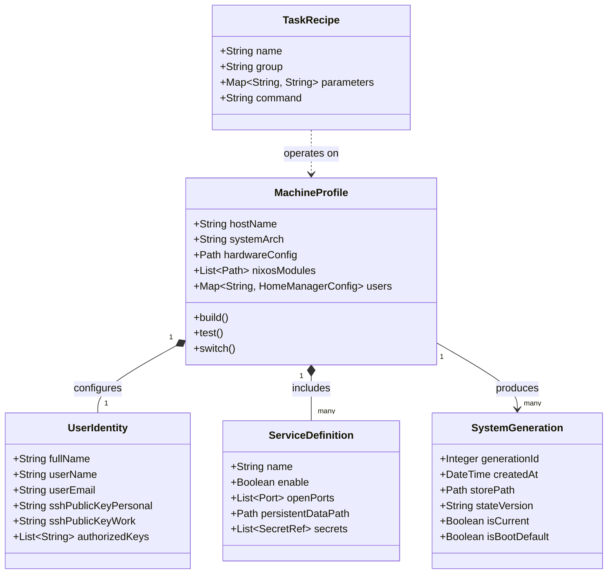
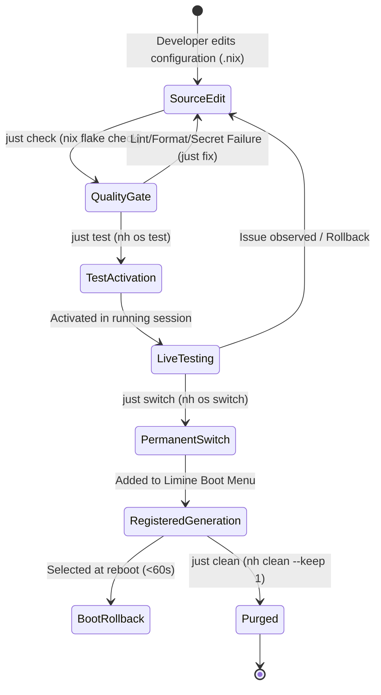

# Data Model & Domain Schema: Core System PRD

**Feature**: `001-system-prd`
**Status**: Completed

## Domain Entities

---

### 1. UserIdentity Entity

Centralized identity parameters defined in `vars.nix` and injected into all system and user configurations.

| Attribute | Type | Description | Validation Rules |
| :--- | :--- | :--- | :--- |
| `fullName` | String | Full name of the system owner | Non-empty string |
| `userName` | String | Primary Unix user account name | Lowercase alphanumeric string matching `^[a-z_][a-z0-9_-]*$` |
| `userEmail` | String | Primary Git and contact email | Valid RFC 5322 email format |
| `sshPublicKeyPersonal` | String | Personal asymmetric public key | Valid OpenSSH public key (`ssh-ed25519 ...`) |
| `sshPublicKeyWork` | String | Work/auxiliary asymmetric public key | Valid OpenSSH public key (`ssh-ed25519 ...`) |

---

### 2. MachineProfile Entity

Declarative host specification represented as a top-level NixOS system derivation in `flake.nix`.

| Attribute | Type | Description | Validation Rules |
| :--- | :--- | :--- | :--- |
| `hostName` | String | Network hostname (`desktop-pc`, `homelab`, `iso`) | Valid RFC 1123 hostname |
| `systemArch` | String | System architecture (`x86_64-linux`) | Supported system architecture |
| `hardwareConfig` | Path | Host hardware specification | Valid Nix file with filesystem/boot device mounts |
| `nixosModules` | List[Path] | System-level modules enabled on this host | Resolvable paths under `modules/nixos/` |
| `homeManagerUsers` | Map[String, Module] | User-level modules mapped per user | Maps `vars.userName` to `modules/home-manager/` |

---

### 3. ServiceDefinition Entity

Declarative background service or daemon configured within `modules/nixos/`.

| Attribute | Type | Description | Validation Rules |
| :--- | :--- | :--- | :--- |
| `name` | String | Canonical service identifier (e.g. `jellyfin`, `adguardhome`) | Non-empty alphanumeric name |
| `enable` | Boolean | Whether service is enabled on the host | Boolean flag |
| `openFirewallPorts` | List[Integer] | Incoming TCP/UDP ports opened in firewall | Valid port numbers `1..65535` |
| `persistentDataPath` | Path | Persistent storage location for state/databases | Absolute path (e.g., `/var/lib/<service>`) |
| `secretReferences` | List[String] | SOPS/Age encrypted secret keys | Resolvable in `config.sops.secrets` |

---

### 4. SystemGeneration Entity

Immutable snapshot of the operating system and user environment registered with the bootloader.

| Attribute | Type | Description | Validation Rules |
| :--- | :--- | :--- | :--- |
| `generationId` | Integer | Monotonically increasing generation number | Positive integer >= 1 |
| `createdAt` | DateTime | Timestamp when generation was built/switched | ISO 8601 timestamp |
| `storePath` | Path | Top-level system closure in `/nix/store` | Valid immutable store path |
| `stateVersion` | String | Pinned state compatibility version (e.g. `26.05`) | Pinned release format `YY.MM` |
| `isBootDefault` | Boolean | Whether this generation is selected as default boot | Single active default per machine |

---

### 5. TaskRecipe Entity

Standardized operational recipe declared in `justfile`.

| Attribute | Type | Description | Validation Rules |
| :--- | :--- | :--- | :--- |
| `name` | String | Recipe command name (e.g. `switch`, `test`, `check`, `clean`) | Unique alphanumeric identifier |
| `group` | String | Category group (`(re)build`, `dev-utils`, `flake-management`, `garbage-collection`) | One of defined groups |
| `parameters` | Map[String, Any] | Named arguments with defaults (e.g. `configuration="desktop-pc"`) | Valid default values |
| `command` | String | Underlying CLI execution string (`nh`, `nix`, `deadnix`) | Executable command in dev shell |

---

## State Transitions & Generation Lifecycle

