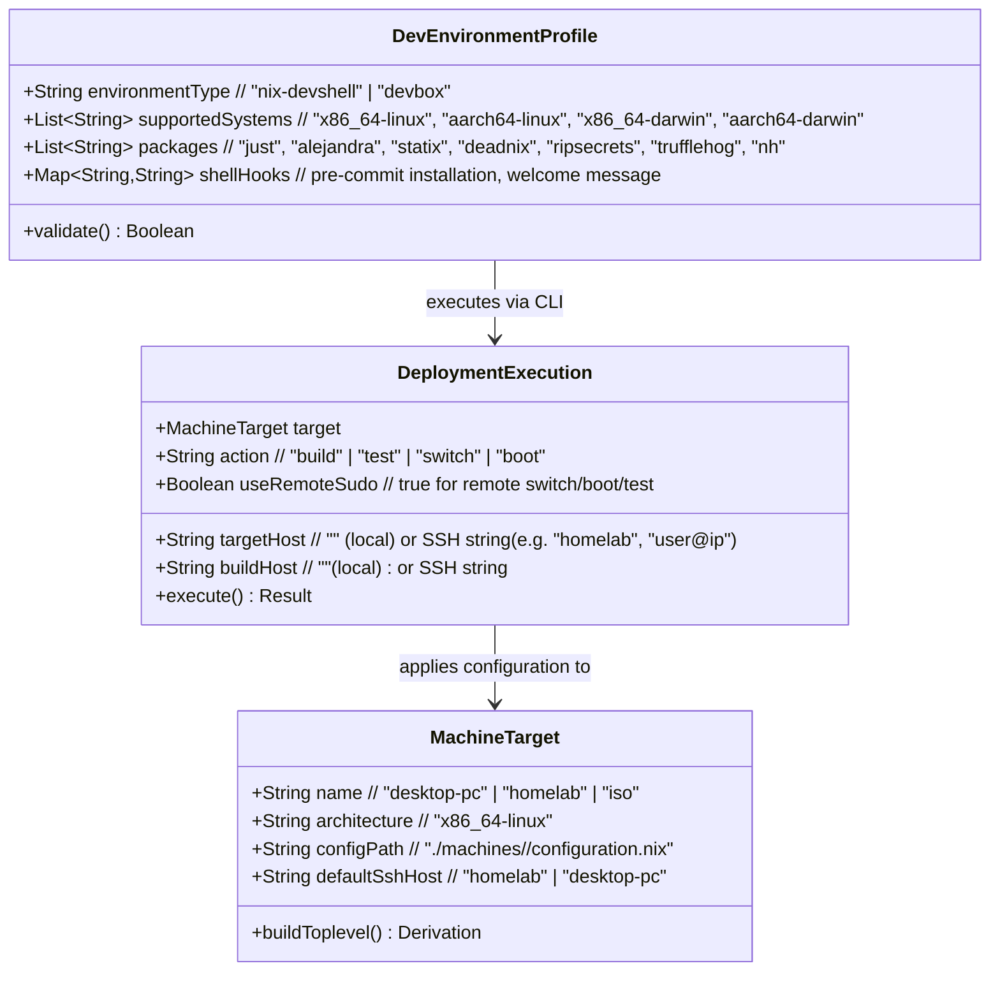
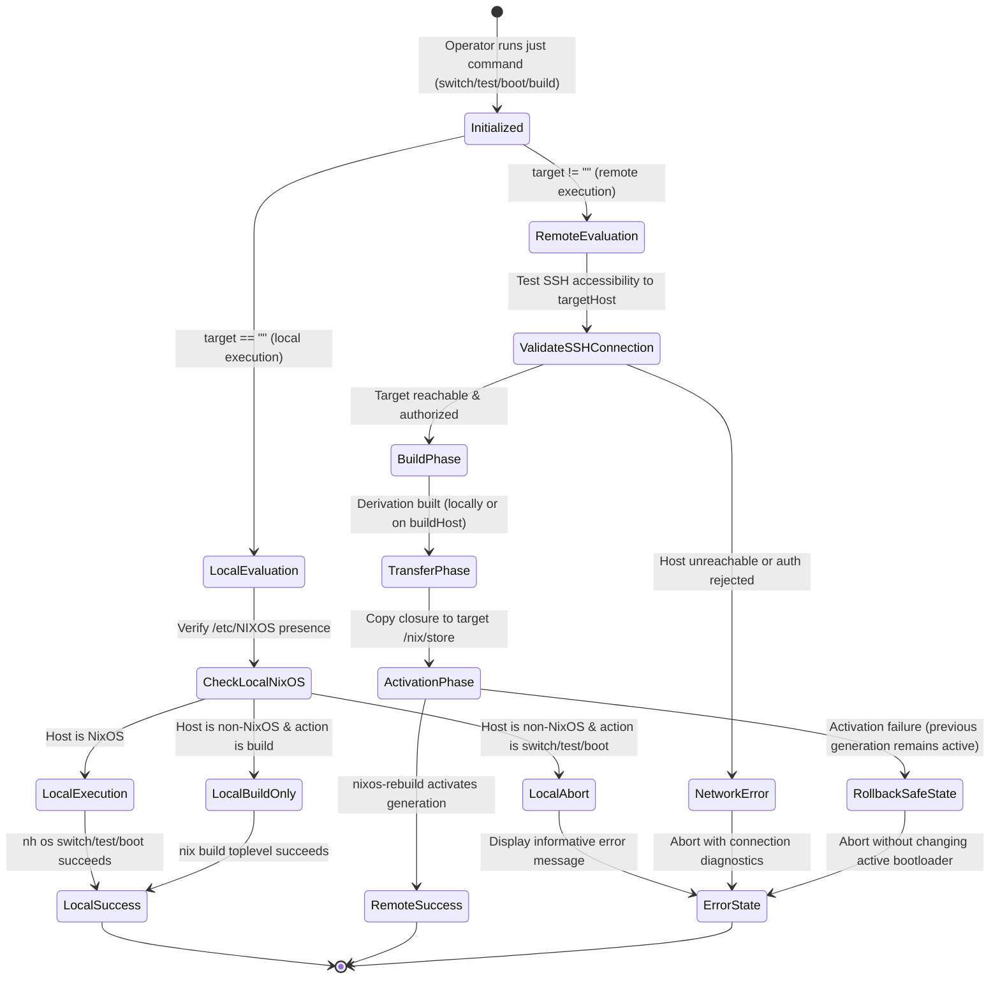

# Phase 1: Data Model & Domain Entities

**Feature**: Portable Multi-Environment Development, Testing, and Deployment (`002-portable-dev-deploy`)
**Date**: 2026-08-12
**Status**: Completed

## 1. Domain Entities & Schemas

### 1.1 Development Environment Profile

Represents the developer workspace configuration across different host platforms and onboarding mechanisms.

### Attributes & Types

| Entity | Attribute | Type | Description |
| :--- | :--- | :--- | :--- |
| **DevEnvironmentProfile** | `environmentType` | Enum (`nix-devshell`, `devbox`) | Method of environment initialization |
| | `supportedSystems` | List[String] | Architectures enabled in `flake.nix` and `devbox.json` |
| | `packages` | List[String] | Linters, formatters, and task runners bundled in the environment |
| | `shellHooks` | List[String] | Automated activation scripts (e.g., git hooks installation) |
| **MachineTarget** | `name` | String | Identifier matching a `nixosConfigurations.<name>` attribute |
| | `architecture` | String | System architecture of the target machine (e.g., `x86_64-linux`) |
| | `configPath` | String | Filesystem path to the host configuration entrypoint |
| **DeploymentExecution** | `action` | Enum (`build`, `test`, `switch`, `boot`) | Target lifecycle operation |
| | `targetHost` | Optional[String] | Remote SSH connection target; empty indicates local execution |
| | `buildHost` | Optional[String] | Remote host to perform derivation building (optional) |
| | `useRemoteSudo` | Boolean | Whether remote activation requires `sudo` privileges over SSH |

---

## 2. Lifecycle State Transitions

### 2.1 Deployment Execution State Machine

---

## 3. Validation & Invariant Rules

1. **Host Safety Invariant**: Repository scripts MUST NEVER invoke `nh os switch`, `nh os test`, or `nh os boot` on a non-NixOS operating system.
2. **Hermetic Environment Invariant**: Entering the environment via either `devbox shell` or `nix develop` MUST supply identical versions of `alejandra`, `statix`, `deadnix`, and `just`.
3. **Atomic Failure Invariant**: If a remote deployment fails at any phase (evaluation, build, transfer, or activation), the target machine MUST retain its active system generation without downtime or bootloader corruption.
4. **Zero-Secret Invariant**: Connection strings for remote hosts MUST NOT contain embedded passwords; SSH authentication MUST use public keys or active SSH agents.
