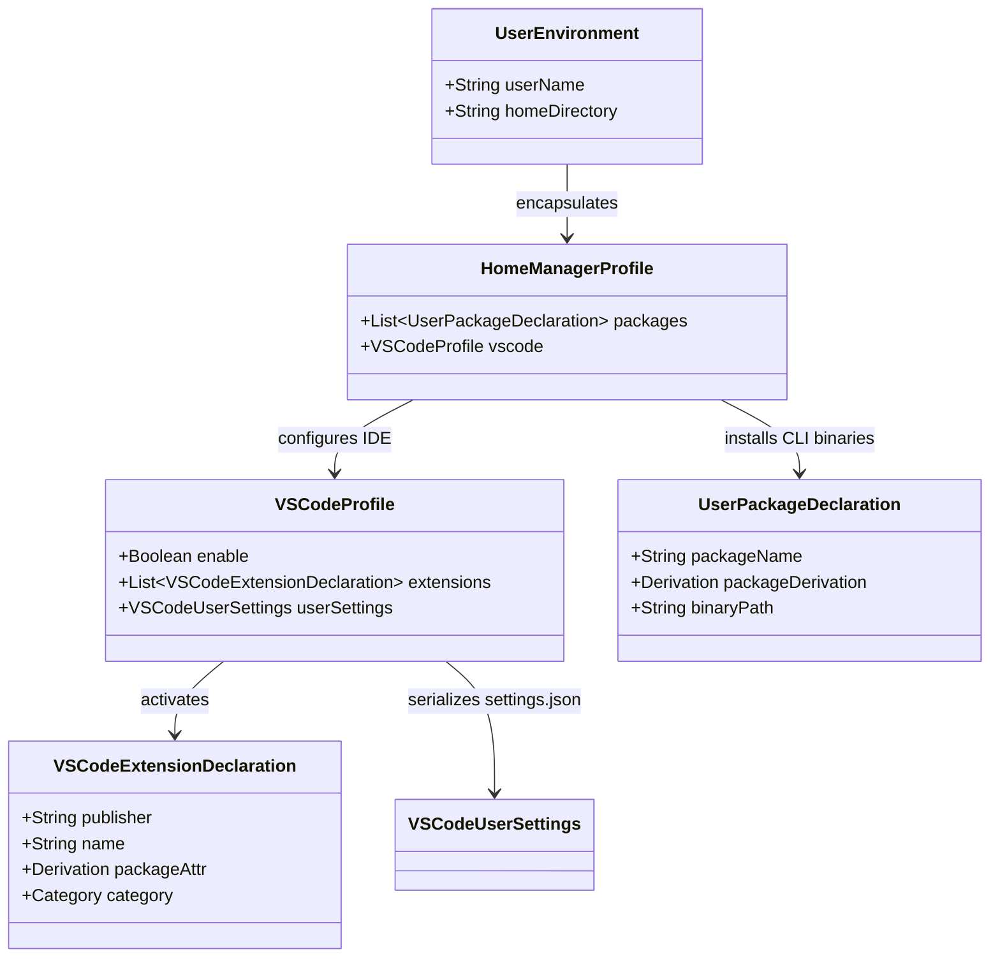
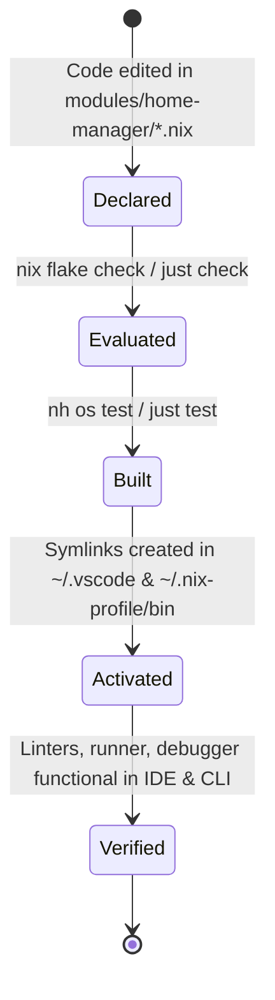

# Data Model & Configuration Schemas: Common Multi-Language VS Code Extensions

**Feature**: `002-vscode-common-extensions` | **Date**: 2026-08-12

This document defines the configuration entities, schemas, attributes, and lifecycle state transitions for declarative VS Code extensions and user development packages.

---

## 1. Core Entities

### Entity: `VSCodeExtensionDeclaration`

Represents a declarative Visual Studio Code extension managed by Home Manager.

| Attribute | Type | Description | Example / Allowed Values |
| :--- | :--- | :--- | :--- |
| `publisher` | `string` | Extension publisher ID | `"formulahendry"`, `"vadimcn"`, `"fill-labs"`, `"davidanson"`, `"timonwong"` |
| `name` | `string` | Extension package identifier | `"code-runner"`, `"vscode-lldb"`, `"dependi"`, `"vscode-markdownlint"`, `"shellcheck"` |
| `packageAttr` | `path / attribute` | Nixpkgs derivation attribute path | `pkgs.vscode-extensions.formulahendry.code-runner` |
| `category` | `enum` | Purpose taxonomy within `vscode.nix` | `Linter`, `Debugger`, `Runner`, `DependencyManagement` |
| `state` | `enum` | Lifecycle activation status | `Declared`, `Evaluated`, `Symlinked`, `Active` |

**Validation Rules**:

- Every declared extension must resolve to a valid derivation in `pkgs.vscode-extensions`.
- Extensions must be categorized under descriptive comment sections in `modules/home-manager/vscode.nix`.

---

### Entity: `VSCodeUserSettings`

Represents user-level IDE preferences rendered into `$HOME/.config/Code/User/settings.json`.

| Setting Key | JSON Type | Default / Target Value | Description |
| :--- | :--- | :--- | :--- |
| `code-runner.runInTerminal` | `boolean` | `true` | Executes code in the integrated terminal rather than the read-only output panel. |
| `code-runner.saveFileBeforeRun` | `boolean` | `true` | Automatically saves the active file before triggering code execution. |
| `code-runner.clearPreviousOutput` | `boolean` | `true` | Clears previous terminal execution output before running. |

**Validation Rules**:

- Must serialize to valid JSON conformant with VS Code settings schema.
- Keys must match official extension configuration namespaces.

---

### Entity: `UserPackageDeclaration`

Represents a CLI utility package installed in the user's environment via Home Manager.

| Attribute | Type | Description | Example / Target Value |
| :--- | :--- | :--- | :--- |
| `packageName` | `string` | Nixpkgs attribute name | `"shellcheck"` |
| `packageDerivation` | `derivation` | Nix package reference | `pkgs.shellcheck` |
| `binaryPath` | `string` | Target binary exported to user PATH | `~/.nix-profile/bin/shellcheck` |
| `targetModule` | `string` | Source configuration module | `modules/home-manager/_packages.nix` |

**Validation Rules**:

- Must be added to `home.packages` in `modules/home-manager/_packages.nix`.
- The derivation must expose its executable in `$out/bin`.

---

## 2. Entity Relationships

---

## 3. Configuration Lifecycle & State Transitions

