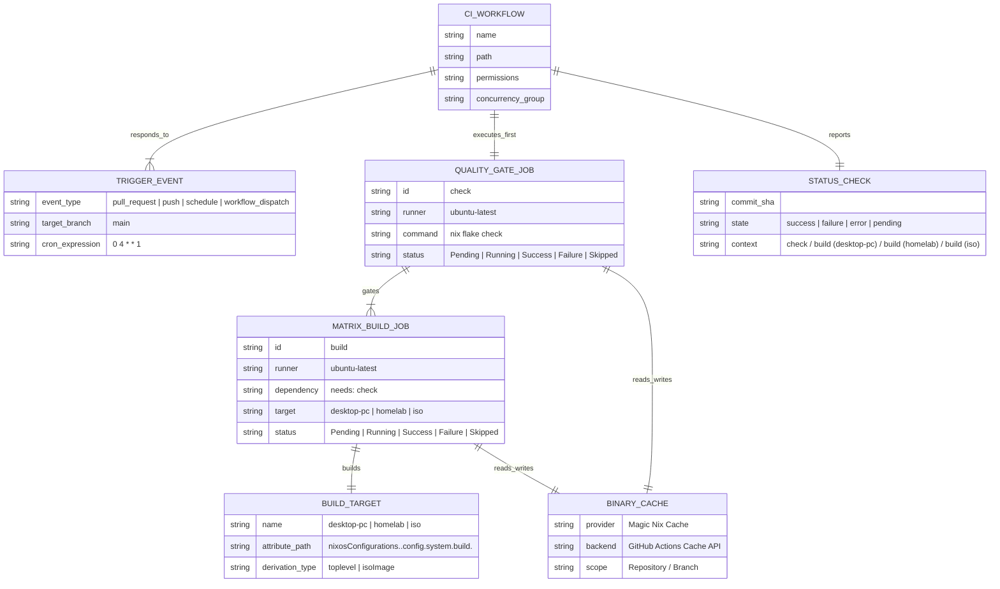
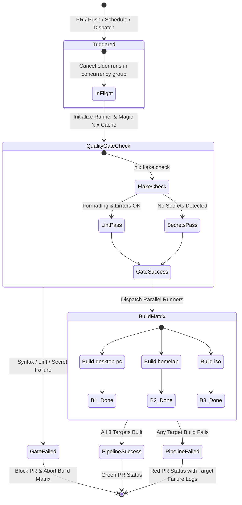

# Data Model: Modern Continuous Integration Pipeline

**Feature Branch**: `003-add-github-ci` | **Date**: 2026-08-12 | **Spec**: [spec.md](spec.md)

## Entity Relationship Overview

---

## Entities & Attributes

### 1. `CI_WORKFLOW`
Represents the top-level GitHub Actions automation file (`.github/workflows/ci.yml`).
- **`name`** (string): Human-readable name displayed in GitHub UI (`CI`).
- **`path`** (string): Relative path from repo root (`.github/workflows/ci.yml`).
- **`permissions`** (map): Security permissions granted to the default `GITHUB_TOKEN` (`contents: read`).
- **`concurrency_group`** (string): Dynamic cancellation key (`${{ github.workflow }}-${{ github.ref }}`).
- **`cancel_in_progress`** (boolean): Automatically terminate superseded runs (`true`).

### 2. `TRIGGER_EVENT`
Represents the GitHub webhook and scheduling events that trigger pipeline execution.
- **`pull_request`**: Triggers on PR creation, synchronization (new commit), and reopening against `main`.
- **`push`**: Triggers on direct commits or merges pushed to `main`.
- **`schedule`**: Weekly scheduled run at Monday 04:00 UTC (`0 4 * * 1`).
- **`workflow_dispatch`**: Manual run triggered from GitHub Actions web interface or CLI.

### 3. `QUALITY_GATE_JOB` (`check`)
Initial fast verification stage executed on `ubuntu-latest`.
- **`runner`**: `ubuntu-latest` (x86_64 Linux).
- **`steps`**:
  1. `actions/checkout@v4`
  2. `DeterminateSystems/nix-installer-action@v16`
  3. `DeterminateSystems/magic-nix-cache-action@v9`
  4. `nix flake check`
- **`sub-checks executed hermetically`**:
  - `alejandra` (formatting validation)
  - `deadnix` (dead code detection)
  - `statix` (Nix antipattern and lint checking)
  - `flake-checker` (Nix flake health and best practices)
  - `trufflehog` + `ripsecrets` + `detect-private-keys` (secret leakage prevention)
  - `check-case-conflicts`, `check-executables-have-shebangs`, `trim-trailing-whitespace`, `end-of-file-fixer`, `mixed-line-endings` (repository hygiene)

### 4. `MATRIX_BUILD_JOB` (`build`)
Downstream parallel build jobs gated by `QUALITY_GATE_JOB`.
- **`dependency`**: `needs: [check]`
- **`runner`**: `ubuntu-latest`
- **`matrix`**:
  - `target: [desktop-pc, homelab, iso]`
- **`target mapping`**:
  - `desktop-pc` → `attribute: .#nixosConfigurations.desktop-pc.config.system.build.toplevel`
  - `homelab` → `attribute: .#nixosConfigurations.homelab.config.system.build.toplevel`
  - `iso` → `attribute: .#nixosConfigurations.iso.config.system.build.isoImage`

---

## State Transition & Execution Flow

