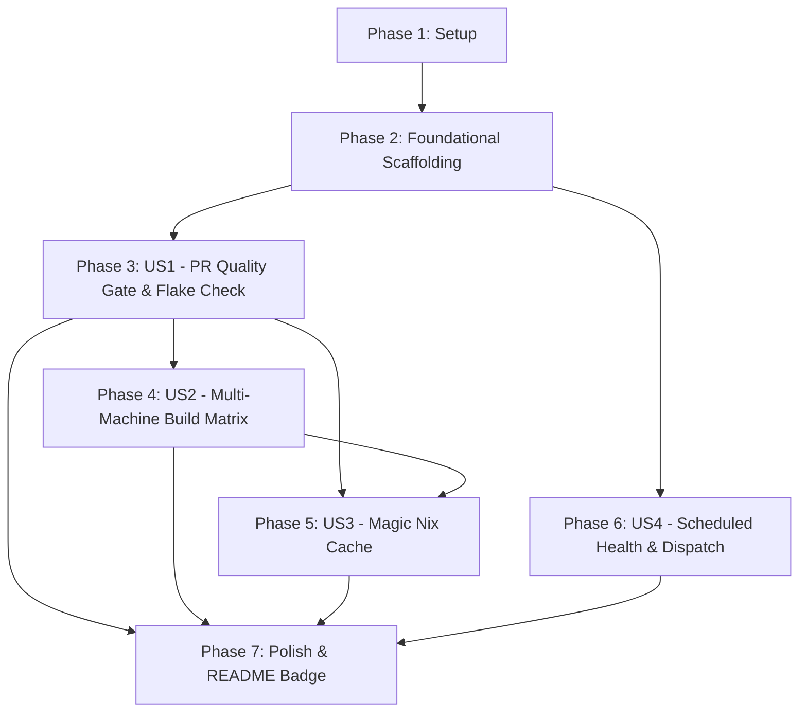

# Tasks: Modern Continuous Integration Pipeline

**Input**: Design documents from [`specs/003-add-github-ci/`](file:///home/lvaylet/workspace/github.com/lvaylet/my-nixos-configurations/specs/003-add-github-ci/)
**Prerequisites**: [plan.md](plan.md), [spec.md](spec.md), [research.md](research.md), [data-model.md](data-model.md), [contracts/ci-workflow-contract.md](contracts/ci-workflow-contract.md), [quickstart.md](quickstart.md)

## Format: `[ID] [P?] [Story] Description`

- **[P]**: Can run in parallel (different files, no dependencies)
- **[Story]**: Which user story this task belongs to (`[US1]`, `[US2]`, `[US3]`, `[US4]`)
- Include exact file paths in descriptions

---

## Phase 1: Setup (Shared Infrastructure)

**Purpose**: Project initialization and directory scaffolding for GitHub Actions workflows

- [X] T001 Create workflow directory structure at [`.github/workflows/`](file:///home/lvaylet/workspace/github.com/lvaylet/my-nixos-configurations/.github/workflows)

---

## Phase 2: Foundational (Blocking Prerequisites)

**Purpose**: Core workflow definition, permissions, concurrency controls, and event triggers

**⚠️ CRITICAL**: Must complete before user story jobs are defined

- [X] T002 Define workflow scaffolding with least-privilege `contents: read` permissions, concurrency group cancellation, and base event triggers in [`.github/workflows/ci.yml`](file:///home/lvaylet/workspace/github.com/lvaylet/my-nixos-configurations/.github/workflows/ci.yml) per [`ci-workflow-contract.md`](file:///home/lvaylet/workspace/github.com/lvaylet/my-nixos-configurations/specs/003-add-github-ci/contracts/ci-workflow-contract.md)

**Checkpoint**: Foundation ready — workflow scaffolding and triggers established.

---

## Phase 3: User Story 1 - Automated Pull Request Quality & Security Gate (Priority: P1) 🎯 MVP

**Goal**: Implement the fast-stage `check` job to validate formatting, static analysis (`deadnix`, `statix`), flake integrity (`flake-checker`), and secret scanning (`trufflehog`, `ripsecrets`, `detect-private-keys`) via `nix flake check` on every PR/push.

**Independent Test**: Run `nix flake check` locally or in CI and verify all quality checks pass cleanly with exit code `0`.

### Implementation for User Story 1

- [X] T003 [US1] Implement `check` job with `ubuntu-latest` runner, `actions/checkout@v4`, and `DeterminateSystems/nix-installer-action@v16` in [`.github/workflows/ci.yml`](file:///home/lvaylet/workspace/github.com/lvaylet/my-nixos-configurations/.github/workflows/ci.yml)
- [X] T004 [US1] Add `nix flake check` execution step with `--print-build-logs` to the `check` job in [`.github/workflows/ci.yml`](file:///home/lvaylet/workspace/github.com/lvaylet/my-nixos-configurations/.github/workflows/ci.yml)
- [X] T005 [P] [US1] Verify local parity between `just check` and CI check execution in [`justfile`](file:///home/lvaylet/workspace/github.com/lvaylet/my-nixos-configurations/justfile)

**Checkpoint**: User Story 1 complete — fast PR quality gate and secret detection operational.

---

## Phase 4: User Story 2 - Automated Multi-Configuration Build Verification (Priority: P2)

**Goal**: Implement the downstream `build` matrix job gated by `needs: [check]` to validate top-level system closures (`desktop-pc`, `homelab`, `iso`) across parallel runners.

**Independent Test**: Trigger build matrix and verify all 3 target derivations evaluate and build successfully in parallel with per-target logging.

### Implementation for User Story 2

- [X] T006 [US2] Implement `build` matrix job with `needs: [check]`, `fail-fast: false`, and `ubuntu-latest` runner in [`.github/workflows/ci.yml`](file:///home/lvaylet/workspace/github.com/lvaylet/my-nixos-configurations/.github/workflows/ci.yml)
- [X] T007 [US2] Configure matrix target inclusion definitions for `desktop-pc`, `homelab`, and `iso` derivations in [`.github/workflows/ci.yml`](file:///home/lvaylet/workspace/github.com/lvaylet/my-nixos-configurations/.github/workflows/ci.yml) per [`ci-workflow-contract.md`](file:///home/lvaylet/workspace/github.com/lvaylet/my-nixos-configurations/specs/003-add-github-ci/contracts/ci-workflow-contract.md)
- [X] T008 [P] [US2] Add matrix `nix build` execution step with `--print-build-logs` in [`.github/workflows/ci.yml`](file:///home/lvaylet/workspace/github.com/lvaylet/my-nixos-configurations/.github/workflows/ci.yml)

**Checkpoint**: User Story 2 complete — parallel multi-machine closure build verification operational.

---

## Phase 5: User Story 3 - High-Performance Build Acceleration & Remote Caching (Priority: P3)

**Goal**: Integrate Magic Nix Cache across both `check` and `build` jobs to automatically persist and restore Nix store paths using GitHub Actions Cache API.

**Independent Test**: Verify Magic Nix Cache action step runs in both `check` and `build` jobs without requiring repository secrets or external tokens.

### Implementation for User Story 3

- [X] T009 [US3] Add `DeterminateSystems/magic-nix-cache-action@v9` step to the `check` job in [`.github/workflows/ci.yml`](file:///home/lvaylet/workspace/github.com/lvaylet/my-nixos-configurations/.github/workflows/ci.yml)
- [X] T010 [US3] Add `DeterminateSystems/magic-nix-cache-action@v9` step to the `build` matrix job in [`.github/workflows/ci.yml`](file:///home/lvaylet/workspace/github.com/lvaylet/my-nixos-configurations/.github/workflows/ci.yml)

**Checkpoint**: User Story 3 complete — tokenless binary caching active across all workflow jobs.

---

## Phase 6: User Story 4 - Scheduled Pipeline Health & Upstream Compatibility Monitoring (Priority: P4)

**Goal**: Enable weekly recurring health checks and manual workflow dispatch triggers to detect upstream flake bitrot.

**Independent Test**: Verify `schedule` cron trigger (`0 4 * * 1`) and `workflow_dispatch` trigger are configured and valid in workflow syntax.

### Implementation for User Story 4

- [X] T011 [US4] Configure `schedule` cron (`0 4 * * 1`) and `workflow_dispatch` trigger events in [`.github/workflows/ci.yml`](file:///home/lvaylet/workspace/github.com/lvaylet/my-nixos-configurations/.github/workflows/ci.yml)

**Checkpoint**: User Story 4 complete — scheduled maintenance runs and manual trigger support active.

---

## Phase 7: Polish & Cross-Cutting Concerns

**Purpose**: Documentation updates, CI status badges, and end-to-end verification

- [X] T012 [P] Add GitHub Actions CI workflow status badge and CI section to [`README.md`](file:///home/lvaylet/workspace/github.com/lvaylet/my-nixos-configurations/README.md)
- [X] T013 Validate workflow syntax and run local validation scenarios per [`quickstart.md`](file:///home/lvaylet/workspace/github.com/lvaylet/my-nixos-configurations/specs/003-add-github-ci/quickstart.md) via [`justfile`](file:///home/lvaylet/workspace/github.com/lvaylet/my-nixos-configurations/justfile)

---

## Dependencies & Execution Order

### Phase Dependencies

- **Setup (Phase 1)**: No dependencies — can start immediately
- **Foundational (Phase 2)**: Depends on Setup completion — BLOCKS all user stories
- **User Story 1 (Phase 3)**: Depends on Foundational phase completion (MVP)
- **User Story 2 (Phase 4)**: Depends on User Story 1 completion (gated on `check` job)
- **User Story 3 (Phase 5)**: Integrates into User Story 1 and 2 jobs
- **User Story 4 (Phase 6)**: Adds triggers to foundational workflow
- **Polish (Phase 7)**: Depends on all user story implementations

### User Story Dependencies

---

## Parallel Execution Opportunities

- **T005** ran in parallel with **T003-T004** (validates local `justfile` while workflow is being authored).
- **T008** ran in parallel with **T006-T007** (validates matrix derivation targets).
- **T012** (README badge) ran in parallel with **T013** (syntax validation).

---

## Implementation Strategy & MVP Scope

1. **MVP (Phases 1-3)**: Deliver `.github/workflows/ci.yml` with the foundational setup and `check` job (User Story 1). This immediately gives the repository automated PR validation for formatting, linting, flake syntax, and secret detection.
2. **Incremental Delivery (Phases 4-6)**:
   - Add parallel `build` matrix for `desktop-pc`, `homelab`, and `iso` (User Story 2).
   - Integrate Magic Nix Cache for instant speedup (User Story 3).
   - Add scheduled cron triggers and workflow dispatch (User Story 4).
3. **Final Polish (Phase 7)**: Update `README.md` with the CI badge and verify end-to-end against `quickstart.md`.
