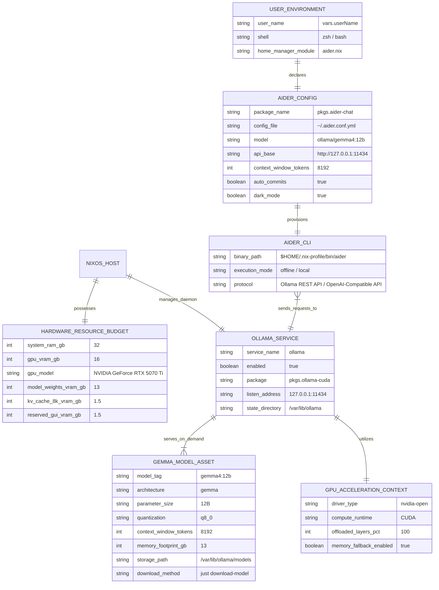
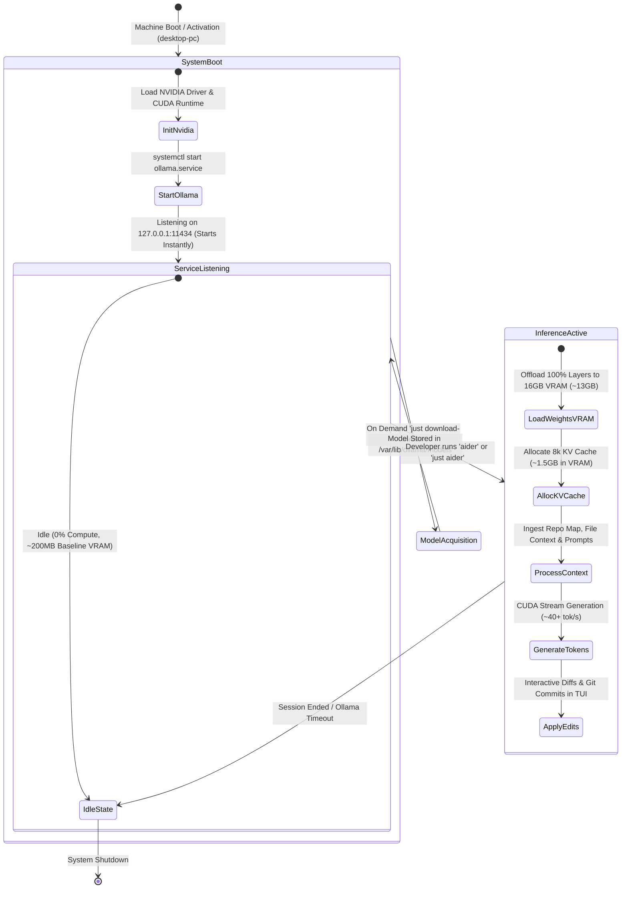

# Data Model: Local Gemma 4 Model Acceleration & Aider CLI Integration

**Feature Branch**: `004-local-gemma-antigravity` | **Date**: 2026-08-12 | **Updated**: 2026-08-13 | **Spec**: [spec.md](spec.md)

## Entity Relationship Overview

---

## Entities & Attributes

### 1. `HARDWARE_RESOURCE_BUDGET`
Defines the physical compute, memory, and acceleration boundaries on the `desktop-pc` workstation.
- **`system_ram_gb`** (integer): 32 GB total physical host RAM.
- **`gpu_vram_gb`** (integer): 16 GB dedicated GDDR7 VRAM on the NVIDIA GeForce RTX 5070 Ti.
- **`model_weights_vram_gb`** (integer): ~12.5–13.0 GB VRAM for 8-bit quantized 12B model weights.
- **`kv_cache_8k_vram_gb`** (float): ~1.2–1.5 GB VRAM for 8,192 token attention/KV cache.
- **`reserved_gui_vram_gb`** (float): ~1.5–2.0 GB unallocated VRAM guaranteed for Wayland/X11 desktop compositing.

### 2. `OLLAMA_SERVICE`
Represents the system-level NixOS background daemon (`modules/nixos/ollama.nix`).
- **`enable`** (boolean): Activates the systemd `ollama.service` unit (`true`).
- **`package`** (package): `pkgs.ollama-cuda` (CUDA-accelerated binary).
- **`host`** (string): Bind address (`"127.0.0.1"`).
- **`port`** (integer): TCP port (`11434`).
- **`home`** (path): Persistent state directory (`/var/lib/ollama`).

### 3. `GEMMA_MODEL_ASSET`
Represents the local large language model weights and configuration.
- **`model_tag`** (string): Canonical model identifier (`gemma4:12b`).
- **`quantization`** (string): 8-bit precision profile (`q8_0`).
- **`context_window_tokens`** (integer): `8192` (8k).
- **`parameter_count`** (string): `12B` parameters.
- **`storage_location`** (path): `/var/lib/ollama/models/blobs/`.
- **`lifecycle`**: Downloaded on demand via `just download-model model="gemma4:12b"`.

### 4. `AIDER_CONFIG`
Represents the user-level Home Manager module configuration (`modules/home-manager/aider.nix`).
- **`package`**: `pkgs.aider-chat` installed in user environment.
- **`config_file`**: `~/.aider.conf.yml` specifying default model (`ollama/gemma4:12b`), dark mode, and git auto-commits.
- **`environment`**: `OLLAMA_API_BASE=http://127.0.0.1:11434`.

---

## State Transition & Execution Flow

