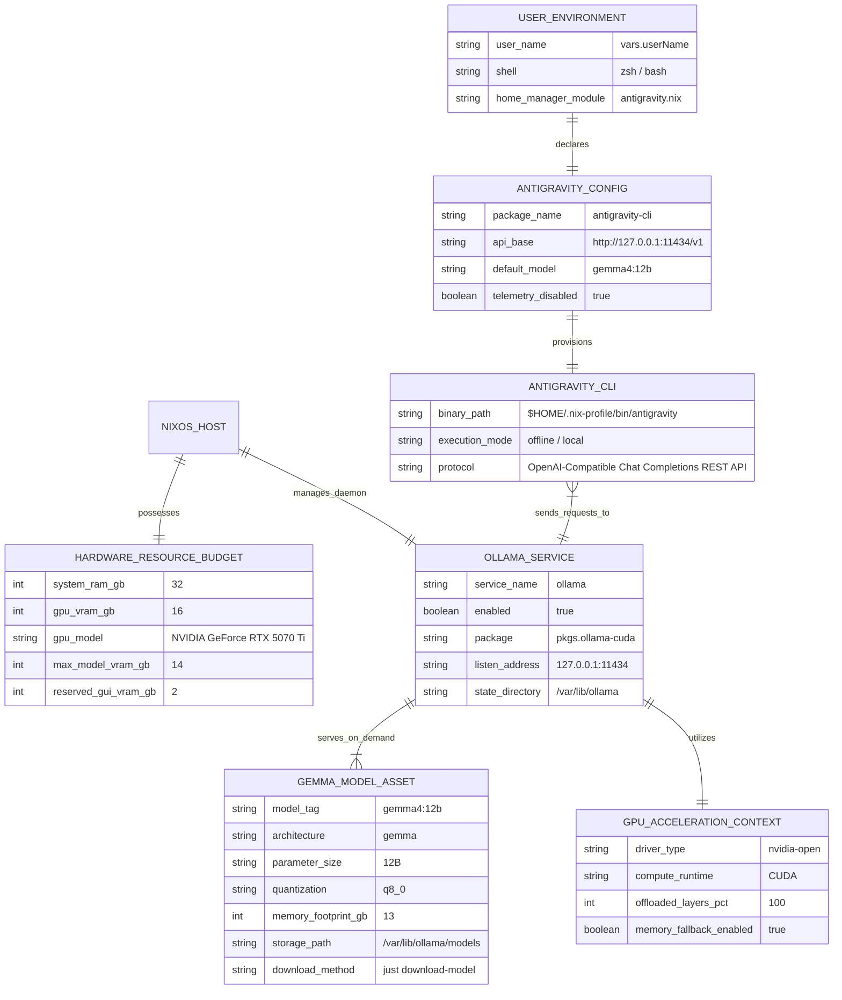
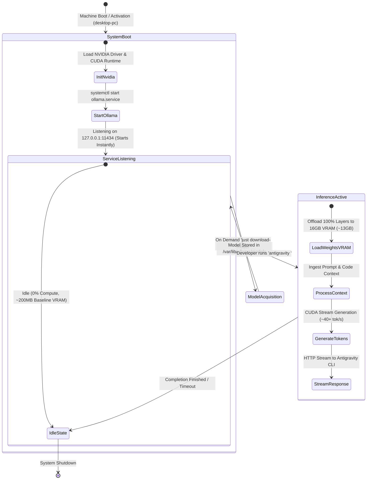

# Data Model: Local Gemma 4 Model Acceleration & Antigravity CLI Integration

**Feature Branch**: `004-local-gemma-antigravity` | **Date**: 2026-08-12 | **Spec**: [spec.md](spec.md)

## Entity Relationship Overview

---

## Entities & Attributes

### 1. `HARDWARE_RESOURCE_BUDGET`
Defines the physical compute, memory, and acceleration boundaries on the `desktop-pc` workstation.
- **`system_ram_gb`** (integer): 32 GB total physical host RAM.
- **`gpu_vram_gb`** (integer): 16 GB dedicated GDDR7 VRAM on the NVIDIA GeForce RTX 5070 Ti.
- **`max_model_vram_gb`** (integer): Maximum target allocation for model weights (~13–14 GB).
- **`reserved_gui_vram_gb`** (integer): Minimum guaranteed unallocated VRAM (~2–3 GB) reserved for desktop display rendering and compositor operations.

### 2. `OLLAMA_SERVICE`
Represents the system-level NixOS background daemon (`modules/nixos/ollama.nix`).
- **`enable`** (boolean): Activates the systemd `ollama.service` unit (`true`).
- **`package`** (package): `pkgs.ollama-cuda` (CUDA-accelerated binary).
- **`host`** (string): Bind address (`"127.0.0.1"`).
- **`port`** (integer): TCP port (`11434`).
- **`home`** (path): Persistent state directory (`/var/lib/ollama`).

### 3. `GEMMA_MODEL_ASSET`
Represents the local large language model weights and configuration.
- **`model_tag`** (string): Canonical model identifier (`gemma4:12b`).
- **`quantization`** (string): 8-bit precision profile (`q8_0`).
- **`parameter_count`** (string): `12B` parameters.
- **`storage_location`** (path): `/var/lib/ollama/models/blobs/`.
- **`lifecycle`**: Downloaded on demand via `just download-model model="gemma4:12b"`.

### 4. `ANTIGRAVITY_CONFIG`
Represents the user-level Home Manager module configuration (`modules/home-manager/antigravity.nix`).
- **`enable`** (boolean): Activates Antigravity CLI in user profile (`true`).
- **`api_base`** (string): Base URL for model completions (`http://127.0.0.1:11434/v1`).
- **`model`** (string): Default model identifier (`gemma4:12b`).
- **`offline_mode`** (boolean): Enforces local loopback routing without cloud fallback (`true`).

---

## State Transition & Execution Flow

