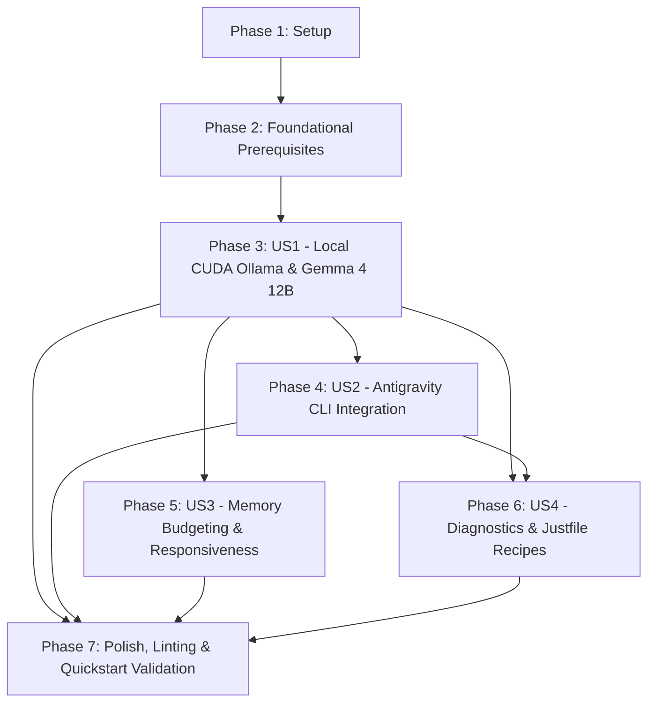

# Tasks: Local Gemma 4 Model Acceleration & Antigravity CLI Integration

**Input**: Design documents from [`specs/004-local-gemma-antigravity/`](file:///usr/local/google/home/lvaylet/workspace/github.com/lvaylet/my-nixos-configurations/specs/004-local-gemma-antigravity/)
**Prerequisites**: [plan.md](plan.md), [spec.md](spec.md), [research.md](research.md), [data-model.md](data-model.md), [contracts/ollama-service-contract.md](contracts/ollama-service-contract.md), [contracts/antigravity-cli-contract.md](contracts/antigravity-cli-contract.md), [quickstart.md](quickstart.md)

## Format: `[ID] [P?] [Story] Description`

- **[P]**: Can run in parallel (different files, no dependencies)
- **[Story]**: Which user story this task belongs to (`[US1]`, `[US2]`, `[US3]`, `[US4]`)
- Include exact file paths in descriptions

---

## Phase 1: Setup (Shared Infrastructure)

**Purpose**: Module scaffolding and directory structure for local model serving and CLI tooling

- [X] T001 Create module files scaffolding for local Ollama service at [`modules/nixos/ollama.nix`](file:///usr/local/google/home/lvaylet/workspace/github.com/lvaylet/my-nixos-configurations/modules/nixos/ollama.nix) and Antigravity CLI at [`modules/home-manager/antigravity.nix`](file:///usr/local/google/home/lvaylet/workspace/github.com/lvaylet/my-nixos-configurations/modules/home-manager/antigravity.nix)

---

## Phase 2: Foundational (Blocking Prerequisites)

**Purpose**: Verify host hardware configuration and NVIDIA GPU prerequisites for CUDA acceleration

**⚠️ CRITICAL**: Must complete before user story module implementations

- [X] T002 Verify NVIDIA driver and graphics module compatibility in [`modules/nixos/nvidia.nix`](file:///usr/local/google/home/lvaylet/workspace/github.com/lvaylet/my-nixos-configurations/modules/nixos/nvidia.nix) for CUDA acceleration on `desktop-pc`

**Checkpoint**: Foundation ready — GPU driver prerequisites verified.

---

## Phase 3: User Story 1 - Local Hardware-Accelerated Model Inference (Priority: P1) 🎯 MVP

**Goal**: Implement declarative NixOS Ollama service with CUDA acceleration, loopback binding, and automatic model pre-loading (`gemma4:12b`), and import it into the `desktop-pc` machine configuration.

**Independent Test**: Evaluate and test `desktop-pc` configuration, verify `ollama.service` starts with CUDA acceleration, and confirm `curl -s http://127.0.0.1:11434/api/tags` lists `gemma4:12b`.

### Implementation for User Story 1

- [X] T003 [US1] Implement declarative Ollama system service with CUDA acceleration and loopback network binding (`127.0.0.1:11434`) in [`modules/nixos/ollama.nix`](file:///usr/local/google/home/lvaylet/workspace/github.com/lvaylet/my-nixos-configurations/modules/nixos/ollama.nix) per [`contracts/ollama-service-contract.md`](file:///usr/local/google/home/lvaylet/workspace/github.com/lvaylet/my-nixos-configurations/specs/004-local-gemma-antigravity/contracts/ollama-service-contract.md)
- [X] T004 [US1] Configure declarative model pre-loading for 8-bit Gemma 4 12B (`services.ollama.loadModels = [ "gemma4:12b" ]`) in [`modules/nixos/ollama.nix`](file:///usr/local/google/home/lvaylet/workspace/github.com/lvaylet/my-nixos-configurations/modules/nixos/ollama.nix)
- [X] T005 [US1] Import [`modules/nixos/ollama.nix`](file:///usr/local/google/home/lvaylet/workspace/github.com/lvaylet/my-nixos-configurations/modules/nixos/ollama.nix) into the host configuration at [`machines/desktop-pc/configuration.nix`](file:///usr/local/google/home/lvaylet/workspace/github.com/lvaylet/my-nixos-configurations/machines/desktop-pc/configuration.nix)
- [X] T006 [P] [US1] Verify NixOS Ollama module evaluation and syntax with `nix flake check`

**Checkpoint**: User Story 1 complete — local CUDA-accelerated Gemma 4 12B inference service operational on `desktop-pc`.

---

## Phase 4: User Story 2 - Antigravity CLI Local AI Pair-Programming (Priority: P1)

**Goal**: Provision the Antigravity CLI package and pre-configure user session environment variables pointing to the local Ollama OpenAI-compatible endpoint.

**Independent Test**: Invoke `antigravity check` in a user shell session and verify it reaches `http://127.0.0.1:11434/v1` and streams completions using `gemma4:12b`.

### Implementation for User Story 2

- [X] T007 [US2] Implement Home Manager module for Antigravity CLI package and session environment variables (`ANTIGRAVITY_API_BASE`, `ANTIGRAVITY_MODEL`, `ANTIGRAVITY_OFFLINE`) in [`modules/home-manager/antigravity.nix`](file:///usr/local/google/home/lvaylet/workspace/github.com/lvaylet/my-nixos-configurations/modules/home-manager/antigravity.nix) per [`contracts/antigravity-cli-contract.md`](file:///usr/local/google/home/lvaylet/workspace/github.com/lvaylet/my-nixos-configurations/specs/004-local-gemma-antigravity/contracts/antigravity-cli-contract.md)
- [X] T008 [US2] Import [`modules/home-manager/antigravity.nix`](file:///usr/local/google/home/lvaylet/workspace/github.com/lvaylet/my-nixos-configurations/modules/home-manager/antigravity.nix) into the desktop user profile in [`machines/desktop-pc/configuration.nix`](file:///usr/local/google/home/lvaylet/workspace/github.com/lvaylet/my-nixos-configurations/machines/desktop-pc/configuration.nix)
- [X] T009 [P] [US2] Verify user environment session variable exports in [`modules/home-manager/antigravity.nix`](file:///usr/local/google/home/lvaylet/workspace/github.com/lvaylet/my-nixos-configurations/modules/home-manager/antigravity.nix)

**Checkpoint**: User Story 2 complete — Antigravity CLI configured and connected to local model endpoint.

---

## Phase 5: User Story 3 - Workstation Memory Budgeting & System Responsiveness (Priority: P2)

**Goal**: Ensure Ollama memory allocation is budgeted (~13–14 GB VRAM) so the Wayland/X11 desktop compositor and graphical applications remain fluid during active inference.

**Independent Test**: Run a sustained completion generation task while actively interacting with graphical desktop windows and monitor VRAM headroom using `nvidia-smi` / `nvtop`.

### Implementation for User Story 3

- [X] T010 [US3] Configure Ollama runtime environment options (`OLLAMA_NUM_PARALLEL`, `OLLAMA_KEEP_ALIVE`) in [`modules/nixos/ollama.nix`](file:///usr/local/google/home/lvaylet/workspace/github.com/lvaylet/my-nixos-configurations/modules/nixos/ollama.nix) to protect desktop VRAM headroom
- [X] T011 [P] [US3] Verify seamless GPU resource sharing between graphical desktop subsystems in [`modules/nixos/nvidia.nix`](file:///usr/local/google/home/lvaylet/workspace/github.com/lvaylet/my-nixos-configurations/modules/nixos/nvidia.nix) and the CUDA inference service

**Checkpoint**: User Story 3 complete — memory budgeting and desktop stability confirmed.

---

## Phase 6: User Story 4 - Model Diagnostics & Resource Monitoring (Priority: P3)

**Goal**: Add operational task runner recipes to `justfile` for inspecting Ollama service health, viewing active models, and monitoring GPU VRAM allocation.

**Independent Test**: Execute `just ollama-status` and `just gpu-status` on the workstation and verify accurate service and GPU metrics.

### Implementation for User Story 4

- [X] T012 [US4] Add diagnostic task runner recipes for Ollama service status, systemd logs, and model listing (`just ollama-status`, `just ollama-logs`, `just ollama-models`) in [`justfile`](file:///usr/local/google/home/lvaylet/workspace/github.com/lvaylet/my-nixos-configurations/justfile)
- [X] T013 [P] [US4] Add GPU resource monitoring and local inference smoke-test recipes (`just gpu-status`, `just test-inference`) in [`justfile`](file:///usr/local/google/home/lvaylet/workspace/github.com/lvaylet/my-nixos-configurations/justfile)

**Checkpoint**: User Story 4 complete — operational observability and diagnostic recipes available.

---

## Phase 7: Polish & Cross-Cutting Concerns

**Purpose**: Code formatting, static linting, end-to-end quickstart validation, and documentation updates

- [X] T014 [P] Apply `alejandra` formatting and verify static linters (`statix check`, `deadnix`) across all modified Nix modules via `just fmt` and `just lint`
- [X] T015 Run hermetic sandbox verification via `just check`
- [X] T016 Validate end-to-end execution scenarios per [`quickstart.md`](file:///usr/local/google/home/lvaylet/workspace/github.com/lvaylet/my-nixos-configurations/specs/004-local-gemma-antigravity/quickstart.md)
- [X] T017 [P] Document local Gemma 4 model acceleration and Antigravity CLI workflow in [`README.md`](file:///usr/local/google/home/lvaylet/workspace/github.com/lvaylet/my-nixos-configurations/README.md)

---

## Dependencies & Execution Order

### Phase Dependencies

- **Setup (Phase 1)**: No dependencies — can start immediately
- **Foundational (Phase 2)**: Depends on Setup completion — BLOCKS all user stories
- **User Story 1 (Phase 3)**: Depends on Foundational phase completion (MVP)
- **User Story 2 (Phase 4)**: Depends on User Story 1 completion (connects to Ollama service)
- **User Story 3 (Phase 5)**: Depends on User Story 1 completion (tunes Ollama memory parameters)
- **User Story 4 (Phase 6)**: Depends on User Story 1 & 2 completion (adds operational recipes)
- **Polish (Phase 7)**: Depends on all user story implementations

### User Story Dependencies

---

## Parallel Execution Opportunities

- **T006** can run in parallel with **T003–T005** (evaluates flake checks while module integration proceeds).
- **T009** can run in parallel with **T007–T008** (verifies environment variable definitions).
- **T011** can run in parallel with **T010** (checks NVIDIA module compatibility).
- **T013** can run in parallel with **T012** (adds GPU recipes in `justfile`).
- **T014** (formatting/linting) and **T017** (documentation) can run in parallel in Phase 7.

---

## Implementation Strategy & MVP Scope

1. **MVP (Phases 1–3)**: Deliver `modules/nixos/ollama.nix` with CUDA acceleration and `gemma4:12b` pre-loading on `desktop-pc`. This immediately delivers an operational local LLM inference engine on the physical workstation with full GPU hardware acceleration.
2. **Incremental Delivery (Phases 4–6)**:
   - Deliver `modules/home-manager/antigravity.nix` for seamless terminal AI pair programming (User Story 2).
   - Tune memory limits and parallel parameters to preserve desktop GUI fluidness (User Story 3).
   - Add convenient `just` task runner recipes for health monitoring and smoke testing (User Story 4).
3. **Final Polish (Phase 7)**: Format all expressions (`just fmt`), lint (`just lint`), run full sandbox checks (`just check`), and validate with `quickstart.md`.
