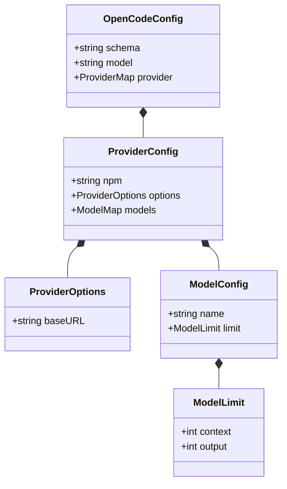

# Data Model: OpenCoder AI Assistant Configuration & Entities

**Feature Branch**: `005-add-opencoder` | **Date**: 2026-08-13 | **Spec**: [spec.md](spec.md)

## Entities Overview

## Entity Details

### 1. OpenCode Configuration (`~/.config/opencode/config.json`)

- **Location**: `~/.config/opencode/config.json`
- **Managed By**: Home Manager (`modules/home-manager/opencode.nix`)
- **Fields**:
  - `$schema` (string): JSON schema validation URL (`https://opencode.ai/config.json`).
  - `model` (string): Default model identifier in format `provider/model` (`ollama/gemma4:12b`).
  - `provider` (object): Map of custom provider configurations.

### 2. Custom Provider Configuration (`provider.ollama`)

- **Fields**:
  - `npm` (string): Underlying provider driver package (`@ai-sdk/openai`).
  - `options.baseURL` (string): HTTP endpoint for OpenAI-compatible API (`http://127.0.0.1:11434/v1`).
  - `models` (object): Map of registered model definitions.

### 3. Model Definition (`models."gemma4:12b"`)

- **Fields**:
  - `name` (string): Display name (`gemma4:12b`).
  - `limit.context` (integer): Context window limit in tokens (`8192`).
  - `limit.output` (integer): Maximum output generation limit in tokens (`8192`).

## Coexistence Model Matrix

| Tool | Config File Location | Model Identifier | Endpoint URL | Context Limit |
| :--- | :--- | :--- | :--- | :--- |
| **Aider** | `~/.aider.conf.yml` | `ollama/gemma4:12b` | `http://127.0.0.1:11434` | 8,192 tokens |
| **OpenCoder** | `~/.config/opencode/config.json` | `ollama/gemma4:12b` | `http://127.0.0.1:11434/v1` | 8,192 tokens |
